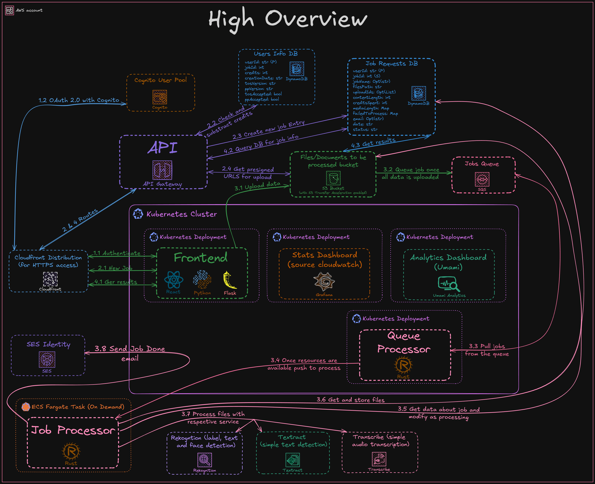
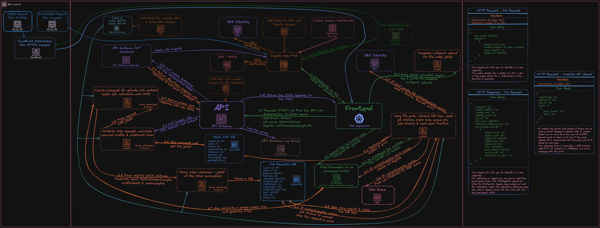
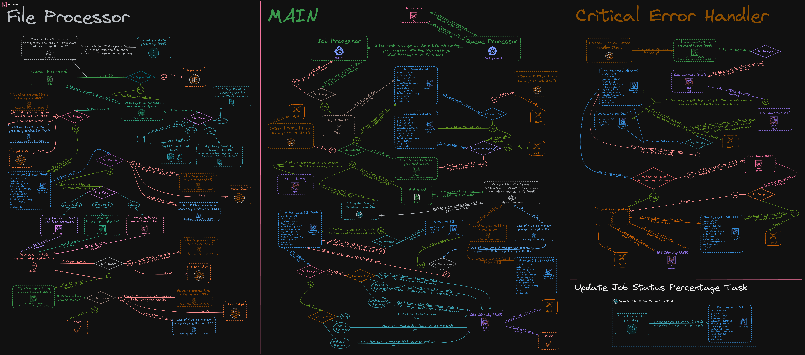
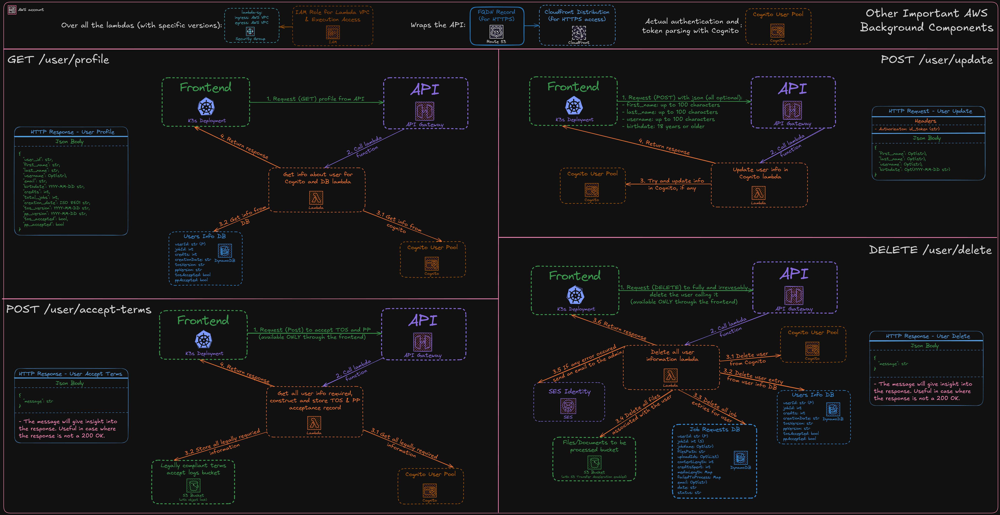
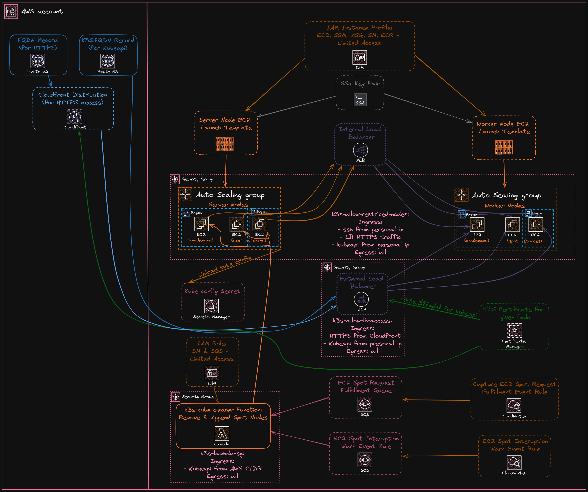

<div id="top"></div>
<a name="readme-top"></a>

<!-- PROJECT LOGO -->
<br />
<div align="center">
  

<h1 align="center"></h1>

<p align="center">
  RekoSearch is an AI-powered file search engine for images, videos, documents and audio that understands the content of your files. It enables simultaneous semantic search across them.
    <p>
        <a href="https://github.com/Obscurely/RekoSearch-Public/wiki"><strong>Explore the docs »</strong></a>
        <br />
        <br />
        <a href="https://rekosearch.com/demo">View Demo</a>
        ·
        <a href="https://github.com/Obscurely/RekoSearch-Public/issues">Report Bug</a>
        ·
        <a href="https://github.com/Obscurely/RekoSearch-Public/issues">Request Feature</a>
    </p>
  </p>
</div>

<!-- TABLE OF CONTENTS -->
<details>
  <summary>Table of Contents</summary>
  <ol>
    <li>
      <a href="#-about-the-project">🪽 About The Project</a>
      <ul>
        <li><a href="#-features">💡 Features</a></li>
        <li><a href="#-demo">🌐 Demo</a></li>
        <li><a href="#-built-with">🍔 Built with</a></li>
      </ul>
    </li>
    <li><a href="#%EF%B8%8F-architecture-diagrams">🏗️ Architecture Diagrams</a></li>
    <li><a href="#-contributing">💁 Contributing</a></li>
    <li><a href="#faq">❓ FAQ</a></li>
    <li><a href="#-security">🔰 Security</a></li>
    <li><a href="#-license">🪪 License</a></li>
    <li><a href="#-contact">📧 Contact</a></li>
  </ol>
</details>

## 🪽 About The Project

RekoSearch is an AI-powered file search engine for images, videos, documents and audio that understands the content of your files. It enables simultaneous semantic search across:

- **Images & Videos**: Find objects, scenes, activities, landmarks, facial attributes and text.
- **Documents**: Search through the actual content (text).
- **Audio**: Search through what's being said.

You can plainly search for what you want, or use advanced search syntax like the example below:

```
label:dog AND face:smiling NOT text:warning
```

(This will find images and videos with a dog and a person smiling, but no text spelling "warning".)

Alternatively, you can also download just the results files.

If you've got any questions please give the [FAQ](#faq) a check.

<p align="right">(<a href="#readme-top">back to top</a>)</p>

### 💡 Features

- [x] AI-Powered Content Search
- [x] Multi-Format Support
- [x] Advanced Search Syntax
- [x] Object and Scene Detection
- [x] Facial Analysis
- [x] Text Recognition
- [x] Audio Transcription
- [x] Batch Processing
- [x] Search Result Downloads
- [x] Secure Data Handling
- [x] Job Management
- [x] Transparent Pricing

<p align="right">(<a href="#readme-top">back to top</a>)</p>

### 🌐 Demo

Check out the [demo](https://rekosearch.com/demo) to see how it works in action.

<p align="right">(<a href="#readme-top">back to top</a>)</p>

### 🍔 Built with

- [AWS](https://aws.amazon.com/)
- [Kubernetes](https://kubernetes.io/)
- [Rust](https://www.rust-lang.org/)
- [Python](https://www.python.org/)
- [Flask](https://flask.palletsprojects.com/)
- [React](https://reactjs.org/)
- [MUI](https://mui.com/)
- [Terraform](https://www.terraform.io/)

<p align="right">(<a href="#readme-top">back to top</a>)</p>

## 🏗️ Architecture Diagrams

### High-Level Overview



A comprehensive overview of RekoSearch's architecture, showing how authentication, job processing, data upload, and result retrieval work together. [View detailed documentation](docs/OVERVIEW.md)

### New Job Flow



Step-by-step process of creating a new file processing job, from user request through authentication, credit checking, S3 upload generation, and job queuing. [View detailed documentation](docs/Application/NEW_JOB.md)

### Server Processing



Detailed workflow of how jobs are processed on the server side, including file processing, AI analysis, error handling, and status updates. [View detailed documentation](docs/Application/SERVER.md)

### User API



Architecture of user-related API endpoints including profile management, user updates, terms acceptance, and account deletion processes. [View detailed documentation](docs/Application/USER_API.md)

### Jobs API


Structure of job-related API endpoints for listing jobs, retrieving job details, accessing file URLs, and deleting jobs. [View detailed documentation](docs/Application/JOBS_API.md)

### K3s Cluster



Infrastructure diagram showing the K3s Kubernetes cluster deployment on AWS with load balancers, auto-scaling, and CloudFront integration. [View detailed documentation](docs/Application/K3S.md)

NOTE: Currently using Digital Ocean K8s cluster for free trial and to slowly integrate the K3s cluster in. Making sure the launch is smooth and without issues.

<p align="right">(<a href="#readme-top">back to top</a>)</p>

## 💁 Contributing

While the actual source code is private if you have any suggestions feel free to open an [Issue](https://github.com/Obscurely/RekoSearch-Public/issues) about them.

Please read [CONTRIBUTING.md](CONTRIBUTING.md) and
[CODE_OF_CONDUCT.md](CODE_OF_CONDUCT.md).

<p align="right">(<a href="#readme-top">back to top</a>)</p>

## ❓FAQ

See [FAQ.md](./docs/FAQ.md) for frequently asked questions.

<p align="right">(<a href="#readme-top">back to top</a>)</p>

## 🔰 Security

If you happen to find any issues please carefully read
[SECURITY.md](SECURITY.md) and strictly follow everything stated.

<p align="right">(<a href="#readme-top">back to top</a>)</p>

## 🪪 License

Is licensed under [Creative Commons Attribution-NonCommercial-NoDerivatives 4.0 International](https://creativecommons.org/licenses/by-nc-nd/4.0/)

<p align="right">(<a href="#readme-top">back to top</a>)</p>

## 📧 Contact

Either post an issue in the
[Issues Tab](https://github.com/Obscurely/RekoSearch-Public/issues) or contact
me at this email address if you have more to say:
[contact@rekosearch.com](mailto:contact@rekosearch.com)

<p align="right">(<a href="#readme-top">back to top</a>)</p>

[](https://ko-fi.com/K3K3H29LV)
