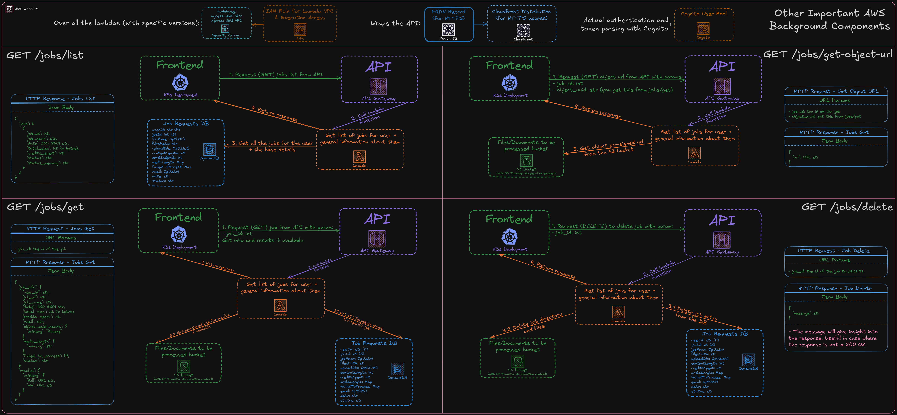

# Jobs API

In this section, you will find a step-by-step explanation of how each of the user API methods works under the hood. Plus some other details.

The available methods are:

- [GET /jobs/list](#jobs-list-steps) for getting the complete list of jobs tied to the user and some basic information.
- [GET /jobs/get](#jobs-get-steps) for getting complete information regarding a single job, including results if available.
- [GET /jobs/get-object-url](#jobs-get-object-url-steps) for getting pre signed S3 URLs to objects in order to view them. (The files uploaded by the user)
- [DELETE /jobs/delete](#jobs-delete-steps) for deleting a specific job and all and any information attached to it.

See [API Documentation](../API/v1/JOBS.md) for more information regarding how to use the API methods discussed here.

## Jobs List steps

1. The API authenticates the request using Congito and then calls a lambda function.
1. The lambda function retrieves all job items from the Job Requests Database related to the user, parsing them to return only the base information. (It uses an optimized query to avoid requesting unnecessary details and save on costs)

## Jobs Get steps

1. The API authenticates the request using Congito and then calls a lambda function.
1. The lambda function retrieves the job item for the requested job from the Job Requests Database.
1. Using this information, it also retrieves a pre-signed S3 URL for the results and combines everything, returning the response.

## Jobs Get Object URL steps

1. The API authenticates the request using Congito and then calls a lambda function.
1. Using the provided job_id, object uuid, and user_id from the authentication token, it composes the key required to retrieve the job from the S3 bucket and creates a presigned URL, returning it.

## Jobs Delete steps

1. The API authenticates the request using Congito and then calls a lambda function.
1. Deletes the requested job entry from the Job Requests Database and all the files associated with it in the S3 Bucket.
