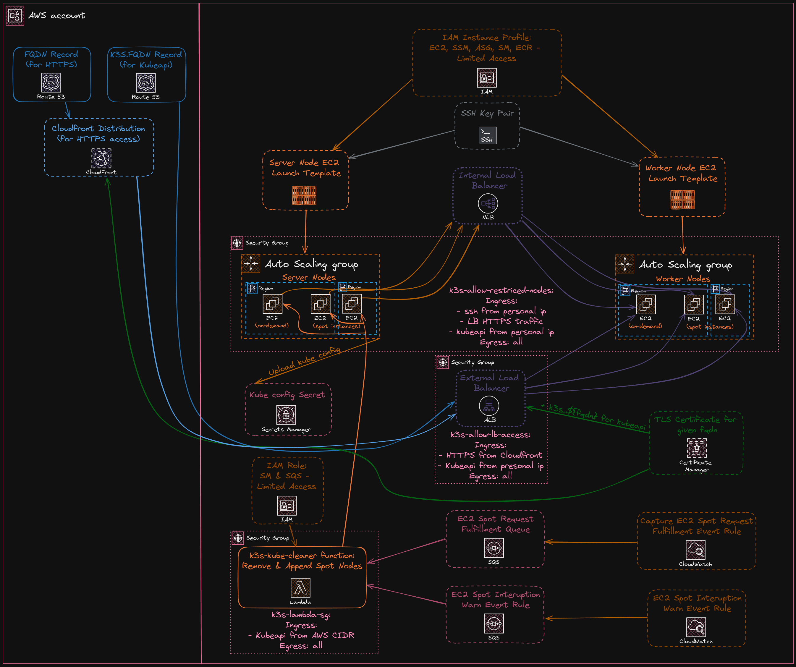

# K3s Cluster on AWS with Terraform

I could have written this module from scratch, but deploying a proper, secure
K8s cluster that is scalable, efficient and self-managed, takes a lot of work. I
decided to base this module on this already great project:
[k3s-aws-terraform-cluster](https://github.com/garutilorenzo/k3s-aws-terraform-cluster),
improve it and tailor it to my needs. [Here](#changes-made) you will find the
chandes I've made.

<!--toc:start-->

- [Features](#features)
- [Requirements](#requirements)
- [Changes Made](#changes-made)
  - [Fixed](#fixed)
  - [Changed](#changed)
  - [Added](#added)
  - [Removed](#removed)
  <!--toc:end-->

## Features

- The Cluster is configurable via variables.
- Automatic creation and management of TLS Certificates (for the given domain).
- Route53 records for CloudFront and K3s Cluster automatically created (if
  creation of cloudfront is enabled).
- HTTPS Access to the Cluster is exposed through Cloudfront (and Cloudfront
  only).
- Application Load Balancer for exposing HTTPS.
- Internal Network Load Balancer for the highest speeds between instances.
- Instances storage is encrypted.
- Restricted Security Groups across the board.
- Very restricted IAM policies.
- The whole Cluster is dual-stack (IPv4 and IPv6 compatible).
- Uses a mix of on-demand and spot instances.
- The Cluster scales automatically.
- Automatically handles nodes being destroyed (i.e., with spot instances) or new
  nodes being created (by the ASG).
- Instances are automatically set up: Nginx Ingress, helm, aws node termination
  handler, and all the necessary setups.
- The Kube configuration is automatically uploaded to AWS Secrets Manager.

## Requirements

- An AWS account, obviously.
- An IPv6 enabled VPC with address assigned to default subnets. Use the ipv6
  module for this.
- A configured hosted zone for a custom domain.

## Changes Made

### Fixed

- Fixed some tags containing invalid characters.
- Fixed the EC2 instances being unable to read the user-data scripts since they
  were compressed with gzip.
- Fixed the block device mappings on the EC2 instances.

### Changed

- The module automatically identifies the default VPC and its subnets with all
  the required information, so you don't need to supply the IDs and CIDRs
  manually.
- Changed the on-demand base capacity of the server & worker instances to 1 from
  0, making the cluster more resilient.
- The users can set the percentage of instances they want to be on-demand over
  the base capacity.
- Default K3s version to always be latest for security reasons.
- Force install node termination handler and use the latest version because it's
  simply best practice and makes the cluster self-managed by default.
- Force install nginx ingress and use the latest version. The default for K3s is
  Traefik, and while I am a big fan of it (and use it on my home server), I find
  it overkill for this.
- Changed the external load balancer from a Network Load Balancer to an
  Application Load Balancer. I've tried a lot to get Cloudfront to work with an
  NLB, but with no success. Also, I enabled it to drop invalid headers.
- The external load balancer is now created by default, as it's a must for
  Cloudfront.
- All the External Load Balancer listeners and target groups are secured with
  HTTPS instead of plain TCP.
- Renamed multiple resources and tags to be easier to understand.
- Changed the Lambda function architecture to ARM64 to be more cost-effective
  and efficient.
- Update Lambda Python version from 3.9 to 3.11.

### Added

- Added IPv6 support across the board (EC2, Load Balancers etc.). The cluster is
  now dual-stack, making it future-proof for when all AWS services will support
  IPv6.
- Added a security group to the external load balancer, locking it down further.
- Added an IAM policy for getting an ECR authentication token (for use with Helm
  and the AWS repo).
- Automatically archive the lambda function and get its hash.
- Automatically gather the latest Amazon Linux 2023 AMI.
- Enable IMDSv2 on all EC2 instances.
- Added a string suffix to the AWS Secrets Manager secret containing the kube
  config file in order to avoid errors when recreating the cluster and that
  secret hasn't yet been deleted.
- Added descriptions to all security group rules and IPv6 CIDRs.
- Restrict the security group rules more.
- Added more control over how instances are created.
- Added the option to create a CloudFront distribution over the cluster for
  improved security and performance (and everything a CDN does).
- It creates TLS certificates for the ALB and Cloudfront using ACM.
- It automatically creates IPv4 and IPv6 records in Route53 for the given domain
  and FQDN.

### Removed

- Removed the common prefix in the tags.
- Removed support for custom route tables since I didn't need it or find it
  helpful.
- Removed cert-manager as it has no use since the cluster should be setup with
  Cloudfront.
- Removed EFS support since I don't have any persistent storage requirements.
- Removed the HTTP endpoints. All traffic happens over only HTTPS now.
- Removed the Lambda workaround, as that issue has been fixed.
- Removed the VPC Endpoint that was used for AWS Secrets Manager, as it's not
  worth the cost of the minimal extra security it provides.
