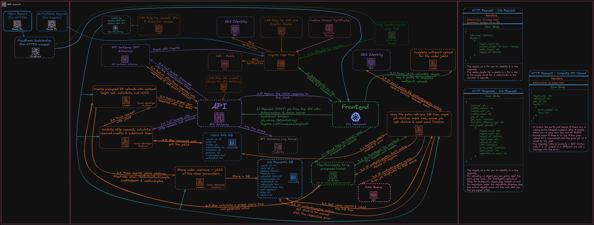

# New Job

Here you will find a step-by-step explanation of how creating a new file processing job works under the hood. Plus some other details

<!--toc:start-->

- [Steps](#steps)
- [Multi-part Upload](#multi-part-upload)
- [Other details](#other-details)
- [Additional Resources](#additional-resources)
<!--toc:end-->

## Steps

1. When a user clicks "new job," the React frontend passes the request to the Flask backend, which retrieves the authentication token associated with the user's cookie and then passes the request forward to the API (API Gateway).
1. The API has an authorizer in front of it (Cognito Authorizer) that verifies if that token is authentic, hasn't expired and is valid. If that token is valid, then an AWS Lambda function gets called.
1. First, the function checks if the user has enough credits. If they do, it subtracts them from the User Info database, increments the job_id by one, and retrieves the new job_id.
1. Next, for each object in the request payload, an S3 presigned upload (either Simple Put Object or Multi-part upload) is created with a hard-set object size, metadata for reference and a generated UUID, allowing multiple files with the same name in one job. The expiry time for that URL or those URLs is the time it takes to upload on dial-up, + some headroom + in order from the first one to be uploaded, the time it takes for the objects before to be uploaded.
1. Create a new job entry in the Job Requests Database with all the required information, such as user_id and job_id (making up the key).
1. If everything is successful, we return a response containing information about the new job request, including URLs for file uploads and the necessary information to execute those uploads.
1. Once the frontend receives the response, it will start uploading the objects to the S3 (Transfer Acceleration enabled) bucket, finishing with the metadata empty object marking the upload as complete.
1. Once the upload is complete, another AWS Lambda function is called, which retrieves the job item from the Job Requests Database to verify that the sizes and other details match. If they don't, all objects will be deleted and the user will be refunded. If they do, the job status will be updated to "queued" in the database, be pushed to the SQS queue, and the user will be notified via email if they have chosen to receive notifications.

## Multi-part Upload

You will notice that there is another lambda function on the diagram for multi-part uploads. That's because after you upload the parts to the S3 bucket, the bucket can't automatically mark the upload as complete and turn your upload into an actual object, so it has to be done manually.

## Other details

- It may seem like there are many lambda functions in the diagram, but if you look closely, you will see that a lot of them are marked as "same upload-gen function". There are only three lambda functions: one handling the generation of a new job and upload, one handling the upload completion, and one completing the multi-part uploads.
- Nothing is exploitable; you can't upload more than the actual file size. However, you can upload a longer video, audio, or PDF file, which will be discarded once it reaches the job processor.
- Everything utilizes the least amount of permissions required and is not given access to more than it needs.

## Additional Resources

- [API Documentation for New Job/Upload](../API/v1/UPLOAD.md)
