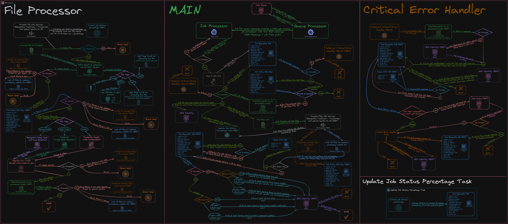

# Server Processing

Here you will find a step-by-step explanation of how the processing of a job works under the hood. Plus some other details

This section comprises three components:

- [MAIN](#main-steps), which is the central part and the beginning of the processing.
- [FILE PROCESSOR](#file-processor-steps), which is the component that handles the AI processing of each file depending on its type
- [CRITICAL ERROR HANDLER](#critical-error-handler-steps) in case there are any critical issues, like failure to update the job or even list the files, this gets called, handling it appropriately, trying multiple approaches, from refunding the user to informing the admin.

## MAIN Steps

1. The Queue Processor pools for 30 seconds at a time the SQS Queue for any new jobs to be processed. Once it finds a job, it creates a new Kubernetes Job which spins up the Job Processor.
1. Next, it retrieves the job item from the Job Requests database, updates the status to "processing," and sends an email to the user if they have opted in, indicating that processing has begun. It then retrieves a list of all job files from S3.
1. It spins up a background task that updates the processing status every 10 seconds, providing the user with frontend updates.
1. It takes all files and, in parallel (e.g, five at once), runs the FILE PROCESSOR on them, storing which files have succeeded the processing and which have failed.
1. Once the processing is complete, the Database is updated accordingly, reflecting the outcome of the processing. If the user has chosen to receive updates, they are informed via an appropriate email.

## FILE PROCESSOR Steps

1. Increase the job percentage by how much this file means.
1. Check whether the file is supported and that it matches the expected size and duration. If it's not, skip it and mark it as such while also refunding the user for the amount it took to process it.
1. Process the file with its respective service, parsing the results once available in a complete and minified version containing only the necessary information for the frontend to work.

## CRITICAL ERROR HANDLER Steps

1. First, it tries to delete all the job files from the bucket. If it can't, then it will email the admin regarding the issue.
1. Then, it will retrieve the amount of credits spent on the job from the Database and refund the user the full amount. If this is successful, inform the user that they have been refunded if they chose to, and then quit. If not, then continue the process.
1. If the above failed: Check if the job hasn't been requeued once already. If it hasn't moved on, requeue it; otherwise, proceed with the following steps.
1. If the above also fails, set the status in the Database appropriately, send the user a critical failure email informing them about their possibilities, and that an admin will take action, and then quit. Also, send an email to the admin.
