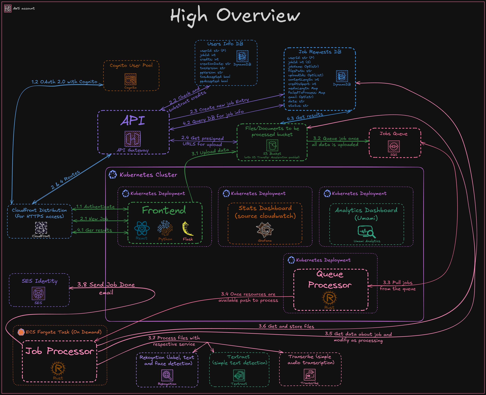

# High Overview of RekoSearch

This is a high-level overview of how RekoSearch works in general, as well as its internal operations. It means the explanation is very abstract and dismissive of details. This is to give you a general idea.

For in-depth information on each component, please refer to [Application Docs](./Application/README.md). For details on the infrastructure, see [Infrastructure Docs](./Infrastructure/README.md).

<!--toc:start-->

- [Application](#application)
  - [1. Authentication](#1-authentication)
  - [2. New Job](#2-new-job)
  - [3. Uploading Data](#3-uploading-data)
  - [4. Getting Results](#4-getting-results)
- [Infrastructure](#infrastructure)
- [Additional Resources](#additional-resources)
<!--toc:end-->

## Application

### 1. Authentication

Authentication is done using Cognito and the OAuth 2.0 standard, the industry
standard used by the likes of Google and Facebook. The outline of how it works
is as follows:

- **Login**: First, go to the /auth/login endpoint or access any route that
  requires authentication, as you will get redirected there. This will, in turn,
  redirect you to the Cognito login page.
- **Authentication**: Log in or sign up (optionally with MFA), and you will be
  redirected back to /auth/callback with an authorization code.
- **Token Exchange and Session Management**: The front end then exchanges the
  code for tokens, validates them, and stores them securely in the session.

### 2. New Job

1. A request is made to the API.
1. The API checks if the user has enough tokens.
1. A new job entry is created, and pre-signed URLs for uploading to the S3 bucket are generated.

### 3. Uploading Data

1. Using the pre-signed URLs, the frontend uploads the files to S3.
1. Once all the files are uploaded, the job is added to the queue.
1. The queue processor picks up the job, and a job processor is spawned for it.
1. The job processor processes the files with their respective AWS services, stores the results in S3, marks the job as complete in the database, and notifies the user via email.

### 4. Getting Results

1. A request is made to the API.
1. If the job is done, it will return its information, along with pre-signed URLs to the results in S3.
   The frontend interprets those results, and thus, the Search Analysis part of the Dashboard magic happens.

## Infrastructure

- The API, CDN, DNS Router, and other components that software interacts with are from AWS (Amazon Web Services). It includes AWS Lambda functions called by the API, too. A non-exhaustive list of the most used services consists of the following: Route53, CloudFront, API Gateway, AWS Lambda, S3, SQS, AWS Cognito, DynamoDB, SES, Event Bridge, CloudWatch, AWS Rekognition, AWS Textract, AWS Transcribe, IAM and ACM.
- The actual applications (Frontend (made of React, Python, and Flask), Job Processor (Rust), Queue Processor (Rust), Stats Dashboard (Grafana), and Analytics Dashboard (Umami)) are deployed in a Kubernetes cluster behind an NGINX reverse proxy as deployments and jobs.

## Additional Resources

- [SUPPORTED.md](./SUPPORTED.md) - A list of supported AWS services and file types.
- [REQUIREMENTS.md](./REQUIREMENTS.md) - A list of requirements for running RekoSearch.
- [PRICING.md](./PRICING.md) - A list of prices for using RekoSearch.
- [FEATURES.md](./FEATURES.md) - A list of features that RekoSearch has.
- [ABOUT.md](./ABOUT.md) - A brief overview of RekoSearch.
- [AUTHENTICATION.md](./AUTHENTICATION.md) - A detailed explanation of the authentication flow.
- [FAQ.md](./FAQ.md) - Frequently Asked Questions about RekoSearch.
- [APPLICATION.md](./Application/README.md) - A detailed explanation of the application architecture and components.
- [INFRASTRUCTURE.md](./Infrastructure/README.md) - A detailed explanation of the infrastructure architecture and components.
- [API Documentation](./API/README.md) - A detailed explanation of the API endpoints and their usage.
